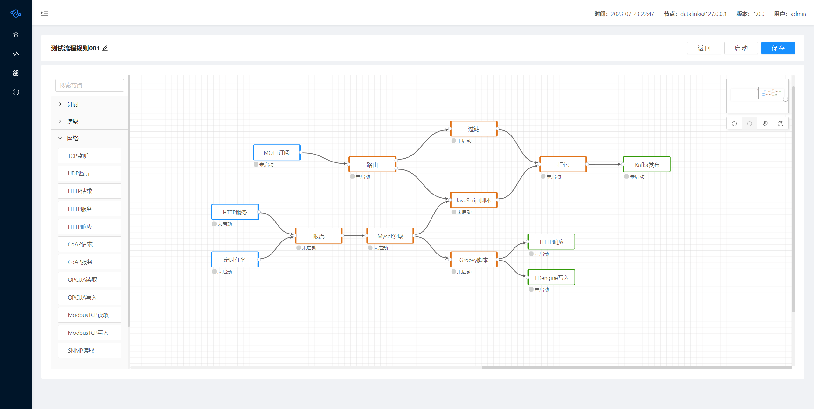

# DATA LINK 可视化数据处理编排

<a href='https://gitee.com/liyang9512/datalink/stargazers'></img></a>
<a href='https://gitee.com/liyang9512/datalink/members'></img></a>

### 一、简介
本项目是基于DataLink开源项目上的二次开发。

原项目地址：[DataLink](https://gitee.com/liyang9512/datalink)

DataLink是一款基于Actor模型开发的数据流程编排工具，通过可视化方式创建数据处理规则。支持监听多种协议端口，订阅消息中间件，以及读写多种数据库。支持分发、过滤、打包、延迟、限流、脚本函数等数据处理。支持最少两个节点的集群模式。

### 二、数据源支持

| **类型** | **数据源**                                         |
|--------|-------------------------------------------------|
| 通讯协议   | TCP、UDP、HTTP、CoAP、OPC UA、SNMP、Modbus TCP        |
| 消息通道   | MQTT、Kafka、RabbitMQ、RocketMQ、ActiveMQ           |
| 数据存储   | Mysql、PostgreSQL、SQL Server、TDengine、Redis、File |

### 三、使用文档

[DataLink使用文档](https://www.yuque.com/xpzakm/kb)

### 四、开源许可

Apache License 2.0

